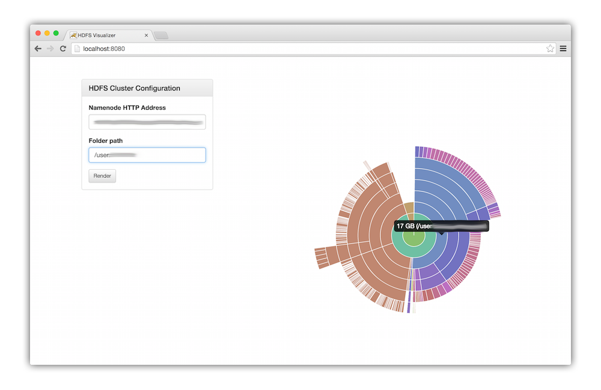

# hdfs-du

Visual disk usage tool for easily getting a sense of what is consuming disk space on your HDFS 2.0 cluster. The filesystem is represented as a layered pie chart or "sunburst" where each nested segment is a subdirectory or file. Hovering over each segment will display the disk usage and full path.

The application is completely client-side, using [Chart.js](http://www.chartjs.org) and Web Workers for rendering.

Credit to [twitter/hdfs-du](http://github.com/twitter/hdfs-du) for the inspiration!



### How to do the things?

Because the project is entirely implemented on the client side, you just need to run a little HTTP web server to serve the content. The built in `bin/www` script can do this for you.

#### Dependencies

- Python 2.7+
- Bower

#### Run the http server

```
$ bower install
$ PORT=1234 bin/www
```

#### Configuration

The application is all client-side and uses the WebHDFS API built into HDFS 2.0+ so you'll need to make sure that is enabled.
